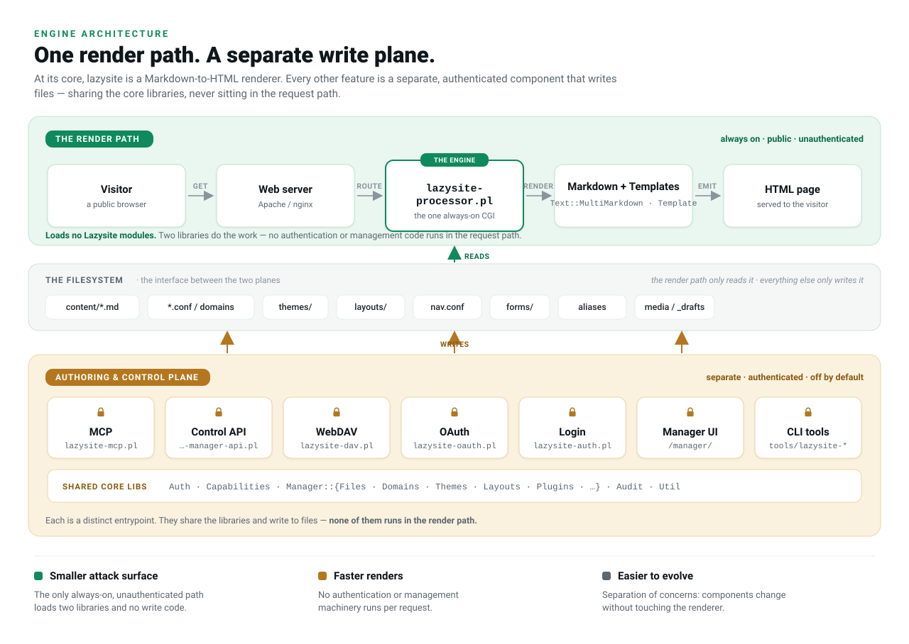

# Render-path separation

## One render path, a separate write plane

At its core, lazysite is a Markdown-to-HTML renderer. Answering a public
request is the whole of what the renderer does: read the content, theme
and layout files for the site, run Markdown and the template, return
HTML. Everything else lazysite can do - authoring, domains, themes, the
API, WebDAV, accounts, the manager - lives in separate components that
**write** files. The renderer only **reads** them. The filesystem is the
interface between the two, and most of the functionality sits *outside*
the render path.

## The render path is deliberately small

`lazysite-processor.pl` is the single always-on entrypoint - the only
part of lazysite that is public, unauthenticated and reachable on every
request. It is kept as lean as the job allows:

- It loads **no `Lazysite::` modules**. Its dependencies are
  `Text::MultiMarkdown` (Markdown to HTML), `Template` (Template
  Toolkit), and `JSON::PP`. Two libraries do the rendering work.
- Where it needs a scrap of logic that also lives in a shared module -
  the group-capability and group-scope resolution - it keeps a
  deliberate module-free local copy rather than pull the `Auth` libraries
  into the request path (ADR 0001). The couple of optional features that
  do need a shared module (`Lazysite::I18n` for chrome strings,
  `Lazysite::Fetch` for the SSRF-guarded include) `require` it lazily, on
  the paths that use it, not at startup.
- It reads shared data that other components produce - for example the
  alias map written by `Lazysite::Aliases` - as **files**, not as shared
  in-memory state or shared code.

The consequence is that no authentication code and no management code is
loaded to serve a page.

## The authoring and control plane

Changing a site is a different path. A caller authenticates, and one of
the write components handles the request, checks the caller's
capabilities, and writes the relevant files:

- `lazysite-mcp.pl` - the MCP connector used by AI agents.
- `lazysite-manager-api.pl` - the HTTP control API behind the manager and
  automation.
- `lazysite-dav.pl` - WebDAV, file-level read and write.
- `lazysite-oauth.pl` - the OAuth authorisation flow that issues tokens.
- `lazysite-auth.pl` - session sign-in for the manager.
- the manager UI under `/manager/`.
- the `tools/lazysite-*` command-line tools.

These share the core libraries - `Auth`, `Capabilities`, the
`Manager::*` modules, `Audit`, `Util` - and each is a distinct
entrypoint. They are off by default and gated by capability. Once they
have written their files they step out of the way; the next visitor is
served by the renderer reading what they left behind. None of them runs
in the render path.

## Why it is built this way

Reduced security surface
: The only always-on, unauthenticated, publicly reachable path is a
  small, read-only renderer. The security-sensitive code - authentication,
  capability checks, everything that writes - is never between a visitor
  and a page.

Performance
: The renderer loads no authentication or management machinery, so there
  is less to do on every request. Renders stay fast because there is
  nothing else to load.

Maintainability
: Separation of concerns. Each feature grows in its own component against
  the shared libraries without touching the renderer. The renderer stays
  stable while the rest of the system evolves, and a change to the
  authoring surfaces cannot affect how a page is served.

## See also

- [Performance](performance.md) - the CGI and FastCGI execution models.
- [Security](security.md) - the capability model and the write guards
  that keep the plane above off the render path.
